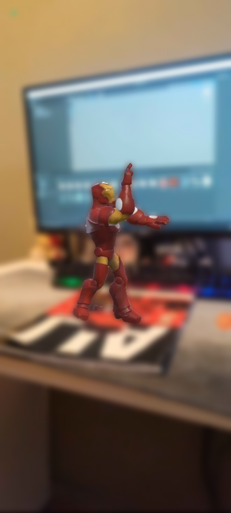

# AR-Dancing-Hero
AR Dancing Hero is an augmented reality (AR) application built with the Unity Engine that brings a dancing hero to life on top of any image of your choice. Using your phone's camera, simply point at a magazine cover (or any other pre-configured image), and watch as a hero character shows up and starts dancing.

## Technologies Used:
- Unity, Unity AR
## How to Install
1. Clone this GitHub Repository to your computer.
2. Open the Project in Unity Hub using Unity Version 2022.3.20f1

## Gameplay Screenshots

